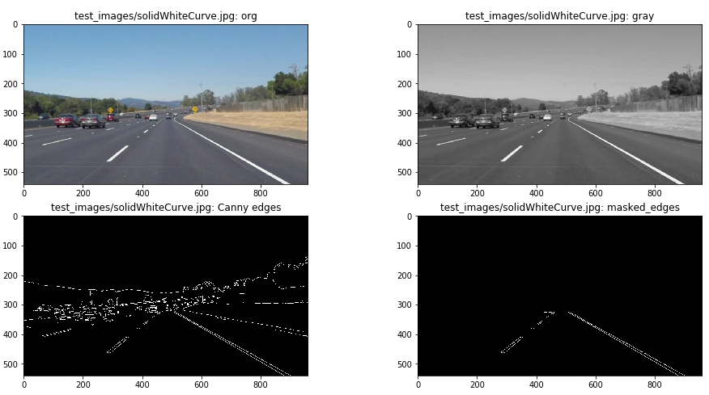
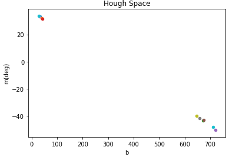

# **Writeup Report Project1**

## Reflection

### 1. Description of "detect_line" 

My pipeline is made up of 4 steps.

The first step is to extract edges.
An input image is blurred by gaussian filter, and get edges by Canny edge detection algorithm.

The second step is to mask areas unrelated to the lane of the extracted edge.
In this step, I use shape of trapezoid for mask.

The third step is to get lines from edges by Hough transform.
In this step, it is necessary to set five parameters, which will greatly affect lane extraction accuracy.

The last step is to detect lanes from the lines.
In this step I extracted a straight line close to the left lane and the right lane respectively from the slope of lines in Hough space. Then, I decided the lane by taking the average value of each.

### 2. Potential shortcomings

My pipeline use only Canny edge detection for detection of edges.
Therefore, there is a possibility that edges can not be extracted, for example, when the color of the road and the color of the lane are similar.

### 3. Possible improvements to this pipeline

In order to improve the extraction accuracy of the edge, there is a possibility that the operation of the color space may be effective.
